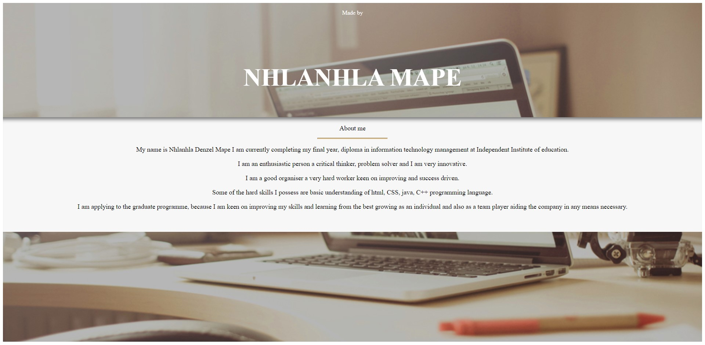

# Grads2022DeveloperAssignment

Clone project:
```
git clone https://github.com/QUINCE15/Grads2022DeveloperAssignment.git
```

Install dependencies:
```
cd my-app
npm i
```

run:
```
npm start
```
setup and overview. create anHTML page. 
load bootstrap via CDN or host it locally include a JQUERY
Load bootstrap Javascrip.
generate your landing page.
Add nevigation bar include custom css
generate a page content container
Add background image and custom JavaScript

# Screenshot

